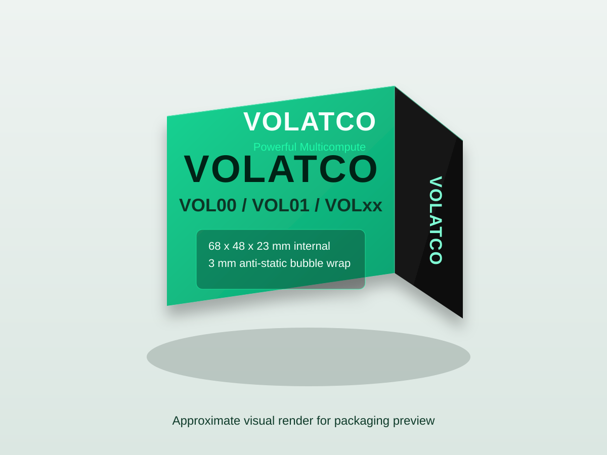

# Volatco board box set

## Quick start

1. Buy/order: `PG-545XL` + `CL-546XL`, A4 photo/matte stock (**170 gsm**), and **1.5 mm** greyboard.
2. Print first: `rigid-wrap-templates/rigid-wrap-template-1.5mm.svg` on A4 at **100% scale** (disable fit-to-page).
3. Build first: use the **1.5 mm greyboard cut list** in the "Rigid box prototype for Canon TS3350 workflow" section.

## Current status

- Date logged: **May 22, 2026**
- Prototype stage: ordering complete.
- Ordered materials:
  - Canon cartridges: **PG-545XL** + **CL-546XL**
  - Paper: **50 sheets** photo/matte stock **170 gsm**
  - Greyboard: **25 sheets**, **1.5 mm**, **925 gsm**
  - Cutting mat: **A3 self-healing mat**
  - Knives: **X-Acto knife set**
  - Blades: **replacement blades pack**
  - Measuring/cutting guide: **steel ruler**
- Next collaboration checkpoint: **May 27, 2026** (when items are expected to be received) to run first physical sample assembly and fit validation.

## Files

- VOLxx mockup: `VOLxx-box.svg`
- VOL00 mockup: `VOL00-box.svg`
- VOL01 mockup: `VOL01-box.svg`
- Cartheur logo asset: `cartheur-logo.jpg`
- Folding dieline: `volatco-folding-pattern.svg`
- VOL00-only dieline: `vol00-folding-pattern.svg`
- 3D folded render: `volatco-box-3d-render.svg`
- Dieline notes: `FOLDING-PATTERN.md`
- Rigid wrap templates:
  - `rigid-wrap-templates/rigid-wrap-template-1.0mm.svg`
  - `rigid-wrap-templates/rigid-wrap-template-1.5mm.svg`
  - `rigid-wrap-templates/rigid-wrap-template-2.0mm.svg`

## Approximate folded 3D render

Palette aligned to Cartheur logo colors sampled from `cartheur-dark-sm.jpg`: primary `#101010`, accent `#20F8A8`.
The actual Cartheur logo is rendered on the SVG assets via `cartheur-logo.jpg`.

## Mechanical and physical specification

### Reference geometry

- Bare board size (from Volatco docs): **60 x 40 x 15 mm**
- ESD protective wrap: **3 mm bubble wrap per side**
- Wrapped board envelope: **66 x 46 x 21 mm**
- Assembly clearance allowance: **+2 mm each axis**
- Final internal box size target: **68 x 48 x 23 mm**
- General folding-pattern print area: **194 x 98 mm**

### Box style and panel construction

- Style: **Straight-line folding carton** (reverse tuck top + friction bottom)
- Glue seam: **12 mm** side glue flap (PVA or hot-melt compatible)
- Main panels:
  - Front/back: **68 x 48 mm**
  - Side panels: **23 x 48 mm**
- Closing flaps:
  - Top flap depth: **25 mm**
  - Bottom flap depth: **25 mm**

### Recommended substrate (paperboard)

Optimal target for this small electronics carton:

- Material: **SBS C1S folding boxboard** (Solid Bleached Sulfate, coated one side)
- Caliper (thickness): **0.50 mm** nominal (approx. 20 pt)
- Basis weight range: **350-400 gsm**

Alternative grades:

- Lightweight option: **0.40 mm (16 pt), ~300-325 gsm**
- Heavy-duty option: **0.60 mm (24 pt), ~420-460 gsm**

### Mechanical targets and tolerances

- Carton should remain closed under normal handling with no tape.
- No visible panel crease whitening on first fold.
- No side wall buckling when lightly squeezed by hand.
- Minimum top-panel load target (static): **1.5 kg** without permanent deformation.
- Die-cut tolerance: **+/-0.20 mm**
- Score-to-score tolerance: **+/-0.15 mm**
- Internal dimension tolerance after folding: **+/-0.5 mm**
- Recommended crease width for 0.50 mm SBS: **1.0-1.2 mm**

### ESD and finish notes

- Use **anti-static pink bubble wrap** or **metallized ESD bubble** at 3 mm thickness.
- Optional ESD shielding bag can be added if total extra film thickness is <=0.2 mm.
- Exterior print: CMYK + optional spot color for Cartheur mint accent `#20F8A8`.
- Finish: **Matte aqueous coating** preferred.
- Keep critical text/marks at least **3 mm** inside cut edges.

## Summary recommendation

Use **SBS C1S, 0.50 mm, 350-400 gsm** with internal dimensions **68 x 48 x 23 mm**, reverse tuck top/friction bottom closure, and **3 mm anti-static bubble wrap** around the board.

## Rigid box prototype for Canon TS3350 workflow

This section is for a hand-built rigid setup box (base + lid), where artwork is printed on lighter paper and mounted onto greyboard.

Reference internal size target:

- Base internal: **68 x 48 x 23 mm**
- Lid wall depth: **15 mm**
- Lid fit clearance: **1.0 mm per side**

Assumptions used for wrap template sizing:

- Turn-in margin: **15 mm**
- Print bleed: **3 mm on all sides**

### Greyboard cut list by thickness

#### 1.0 mm greyboard

- Base bottom: **68 x 48 mm** (1x)
- Base long walls: **68 x 23 mm** (2x)
- Base short walls: **46 x 23 mm** (2x)
- Lid top: **72 x 52 mm** (1x)
- Lid long walls: **72 x 15 mm** (2x)
- Lid short walls: **50 x 15 mm** (2x)

#### 1.5 mm greyboard

- Base bottom: **68 x 48 mm** (1x)
- Base long walls: **68 x 23 mm** (2x)
- Base short walls: **45 x 23 mm** (2x)
- Lid top: **73 x 53 mm** (1x)
- Lid long walls: **73 x 15 mm** (2x)
- Lid short walls: **50 x 15 mm** (2x)

#### 2.0 mm greyboard

- Base bottom: **68 x 48 mm** (1x)
- Base long walls: **68 x 23 mm** (2x)
- Base short walls: **44 x 23 mm** (2x)
- Lid top: **74 x 54 mm** (1x)
- Lid long walls: **74 x 15 mm** (2x)
- Lid short walls: **50 x 15 mm** (2x)

### Print-wrap template sizes (flat) for mounting paper

Formulas:

- Base wrap (no bleed): `(L_out + 2*H_out + 2*turn-in) x (W_out + 2*H_out + 2*turn-in)`
- Lid wrap (no bleed): `(L_lid_top + 2*H_lid_out + 2*turn-in) x (W_lid_top + 2*H_lid_out + 2*turn-in)`
- With bleed: add **6 mm** to width and height.

Where:

- `L_out = 68 + 2t`
- `W_out = 48 + 2t`
- `H_out = 23 + t`
- `H_lid_out = 15 + t`

#### 1.0 mm greyboard

- Base wrap no bleed: **148 x 128 mm**
- Base wrap with bleed: **154 x 134 mm**
- Lid wrap no bleed: **136 x 116 mm**
- Lid wrap with bleed: **142 x 122 mm**

#### 1.5 mm greyboard

- Base wrap no bleed: **152 x 132 mm**
- Base wrap with bleed: **158 x 138 mm**
- Lid wrap no bleed: **140 x 120 mm**
- Lid wrap with bleed: **146 x 126 mm**

#### 2.0 mm greyboard

- Base wrap no bleed: **156 x 136 mm**
- Base wrap with bleed: **162 x 142 mm**
- Lid wrap no bleed: **144 x 124 mm**
- Lid wrap with bleed: **150 x 130 mm**

### Printer practicality notes (TS3350)

- Print wraps on coated matte inkjet paper in the **120-170 gsm** range for clean color and easier wrapping (current order: **170 gsm**).
- Print at **100% scale** (no fit-to-page scaling).
- These wrap sizes are all well within A4 printable workflows.

## Prototype purchasing and first sample plan

Use this as the default first-order list before committing to larger print or packaging runs.

### Shopping list

- Ink cartridges (TS3350 EU/UK family): **PG-545XL** (black) + **CL-546XL** (color)
- Wrap print paper (A4): **photo/matte stock, 170 gsm** (**ordered**)
- Greyboard: **1.5 mm, 25 sheets, ~925 gsm** (**ordered**)
- Adhesive: **PVA/bookbinder glue**
- Tools: **A3 self-healing cutting mat**, **X-Acto knife set**, **replacement blades**, **steel ruler**, bone folder (or blunt creasing tool), clips/masking tape

### Recommended first sample

- Print and build the **1.5 mm** template first:
  - `rigid-wrap-templates/rigid-wrap-template-1.5mm.svg`
- Use the **1.5 mm cut list** in this README (Rigid box prototype section).
- Perform fit check with wrapped board payload before printing additional variants.

### Print settings checklist (Canon TS3350)

- Paper size: **A4**
- Scale: **100%**
- Disable: **Fit to page / Shrink to fit**
- Media type: choose the matching paper profile (for matte coated stock, use matte photo paper profile)
- Quality: **High**

### Assembly order for first test build

1. Build **base only** and test insertion/removal fit using the wrapped board payload.
2. If fit is correct, build **lid**.
3. After mechanical fit is validated, tune artwork color and reprint final wraps.

### Notes

- For first prototypes, use original Canon cartridges to reduce color variability while validating fit/finish.
- If your printer was purchased in a different region, confirm cartridge compatibility on Canon's local TS3350 cartridge page before ordering.
